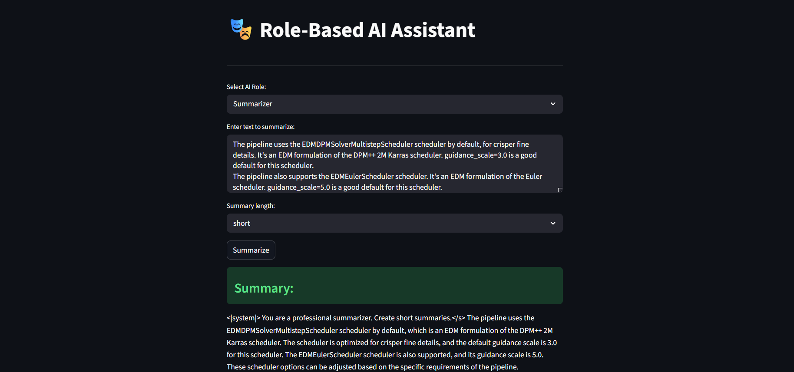

repo
🦙 Local AI Assistant

Your Private, Unlimited AI Companion

✨ Features at a Glance
Role	Capability	Best For
📝 Summarizer	Condense long texts	Articles, reports, documents
✍️ Story Writer	Creative writing	Fiction, narratives, ideas
🌍 Translator	Multi-language	Breaking language barriers
💻 Code Reviewer	Code analysis	Debugging, best practices
👨‍🏫 Teacher	Concept explanation	Learning, studying
📰 Blog Generator	Complete posts	Content creation
🎯 What Makes It Special
🔒 100% Private
text
┌─────────────────────────────────────┐
│  ✓ No cloud uploads                 │
│  ✓ No data tracking                 │
│  ✓ No account needed                │
│  ✓ No internet required (after setup)│
└─────────────────────────────────────┘
💰 Completely Free
text
┌─────────────────────────────────────┐
│  ✓ No API credits                   │
│  ✓ No subscriptions                 │
│  ✓ No rate limits                   │
│  ✓ Unlimited usage                  │
└─────────────────────────────────────┘
🚀 Perfect For...

Content Creators	Students	Developers	Writers
✍️ Blog posts	📚 Study help	💻 Code review	📖 Stories
📝 Summaries	🌍 Translations	🐛 Debugging	🎭 Ideas
✨ Ideas	📖 Explanations	📝 Documentation	✍️ Editing

📊 Performance Overview
text
Hardware            │ Response Time
────────────────────┼─────────────────
CPU (Modern)        │ 10-20 seconds
CPU + GPU           │ 1-3 seconds    
Optimized Setup     │ < 1 second
────────────────────────────────────
Memory Usage        │ 4-8 GB RAM
Storage (One-time)  │ ~2.3 GB
🌟 Why Choose This?

  
Cloud APIs	This Assistant
💰 Pay per token	🆓 Free forever
🔒 Your data on their servers	🔐 Stays on your machine
⚠️ Rate limited	🚀 Unlimited calls
📶 Internet required	📴 Works offline
📝 Usage tracked	🕶️ Completely private
🖥️ Screenshots

  

  
Main Interface

🔮 Coming Soon
📎 Document upload (PDF, DOCX, TXT)

💬 Conversation memory
🎨 Custom role builder
📤 Export conversations
🎤 Voice input
🌙 Dark mode
🤝 Community

Found a bug? 🐛 Report it here
Have an idea? 💡 Suggest feature
Want to contribute? 🔧 Get involved

💬 What Users Say
"Finally, an AI I can use without watching my credit limit!"
— Early User

"The privacy aspect is huge. My code stays on my machine."
— Developer

"Perfect for students who need help but can't afford API costs."
— Educator

📜 License

MIT License • Free for personal & commercial use
Use it, modify it, share it — no restrictions.

⭐ Support the Project

If you find this useful, consider:
Sharing with friends 👥
Starring on GitHub ⭐
Built with ❤️ for the open-source community
Your data. Your computer. No limits.

